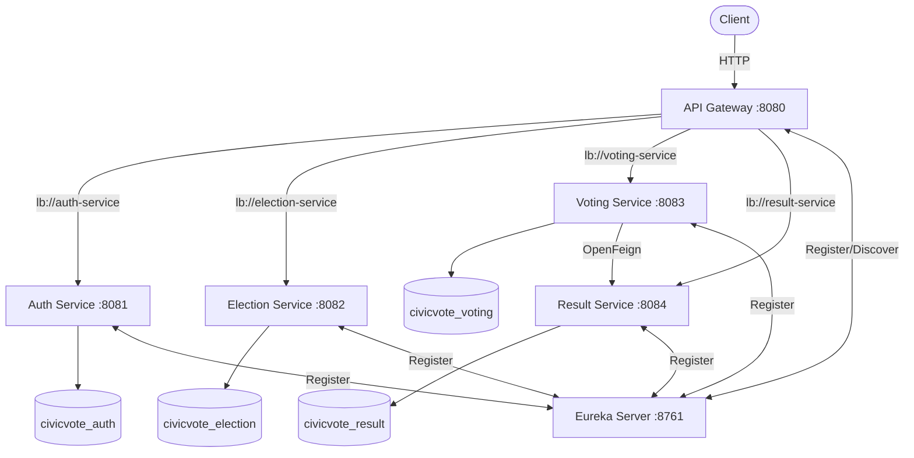

# CivicVote – Tamper-Resistant Digital Election & Vote Auditing System

A production-grade microservices platform for secure, anonymous, and tamper-evident digital voting.

---

## 1. Business Problem

Traditional voting systems face challenges of transparency, security, and accessibility. Paper-based systems are hard to audit; centralized digital systems are single points of failure and trust.

**CivicVote** solves this with a distributed, JWT-secured microservices architecture that:
- Authenticates voters securely
- Enforces one vote per user per election
- Keeps ballots anonymous
- Provides tamper-evident audit trails using SHA-256 cryptographic hashing
- Calculates transparent election results

---

## 2. Solution

A Spring Boot 3.x microservices system with:
- Stateless JWT authentication
- Role-based access control (ADMIN / VOTER)
- Anonymous ballot storage
- SHA-256 ballot integrity verification
- Eureka service discovery
- API Gateway with load balancing
- Feign inter-service communication
- MySQL databases (separate per service)
- Docker containerization

---

## 3. Architecture Diagram



---

## 4. Microservices

| Service | Port | Description |
|---------|------|-------------|
| **eureka-server** | 8761 | Service discovery |
| **api-gateway** | 8080 | Routes, auth filter, CORS, load balancing |
| **auth-service** | 8081 | Registration, login, JWT |
| **election-service** | 8082 | Election CRUD, candidates, lifecycle |
| **voting-service** | 8083 | Vote casting, audit, integrity |
| **result-service** | 8084 | Result calculation, summaries |

---

## 5. Technology Stack

| Layer | Technology |
|-------|-----------|
| Language | Java 21 |
| Framework | Spring Boot 3.3.5 |
| Cloud | Spring Cloud 2023.0.3 |
| Security | Spring Security + JWT (JJWT 0.12.3) |
| Database | MySQL 8.0 + JPA/Hibernate |
| Service Discovery | Netflix Eureka |
| API Gateway | Spring Cloud Gateway |
| Inter-service | OpenFeign |
| API Docs | Springdoc OpenAPI / Swagger |
| Testing | JUnit 5 + Mockito |
| Containerization | Docker + Docker Compose |
| Build | Maven 3.9 |

---

## 6. Authentication Flow

```
POST /api/auth/register  →  Create user (VOTER or ADMIN)
POST /api/auth/login     →  Returns JWT token
GET  /api/auth/me        →  Get current user info (JWT required)
```

JWT contains: `userId`, `username`, `role`, `issuedAt`, `expiration`

Passwords are hashed with **BCrypt**. Tokens are stateless (no server-side sessions).

---

## 7. Voting Flow

```
Voter → POST /api/votes
  → JWT verification
  → Election exists & is ACTIVE
  → Candidate belongs to election
  → Voter eligibility check
  → Duplicate vote check (DB unique constraint)
  → Anonymous ballot created (no userId→candidateId link)
  → Participation record created (userId→electionId only)
  → SHA-256 integrity hash computed & stored
  → Audit record created
  → Result Service notified via Feign
  → Confirmation returned (no candidate revealed)
```

---

## 8. Anonymous Ballot Design

The system separates two records:

| Record | Contains | Purpose |
|--------|----------|---------|
| `Ballot` | `electionId`, `candidateId`, `integrityHash` | Anonymous vote |
| `VoterParticipation` | `electionId`, `voterReference` | Eligibility tracking |

The **ballot does not contain** `userId`. Result APIs never expose which candidate a specific user voted for.

---

## 9. Tamper-Evident Audit Mechanism

When a ballot is cast:
```
ballot_data = electionId + "|" + candidateId + "|" + salt(username + nanoTime)
integrityHash = SHA-256(ballot_data)
```

The hash is stored with both the ballot and the audit record.

**Verification endpoint**: `GET /api/votes/audit/verify` (ADMIN only)

Returns:
```json
{
  "totalRecordsChecked": 100,
  "validRecords": 100,
  "invalidRecords": 0,
  "integrityStatus": "VALID"
}
```

> **Note**: This is **tamper-evident**, not an absolute guarantee. Direct database modification would still alter the stored hash, which is why the audit hash format is validated.

---

## 10. API Endpoints

### Auth Service
| Method | Path | Role | Description |
|--------|------|------|-------------|
| POST | /api/auth/register | Public | Register new user |
| POST | /api/auth/login | Public | Login and get JWT |
| GET | /api/auth/me | Any | Get current user |

### Election Service
| Method | Path | Role | Description |
|--------|------|------|-------------|
| GET | /api/elections | Any | List all elections |
| GET | /api/elections/{id} | Any | Get election |
| POST | /api/elections | ADMIN | Create election |
| PUT | /api/elections/{id} | ADMIN | Update election |
| DELETE | /api/elections/{id} | ADMIN | Delete election |
| POST | /api/elections/{id}/activate | ADMIN | Activate election |
| POST | /api/elections/{id}/close | ADMIN | Close election |
| GET | /api/elections/{id}/candidates | Any | List candidates |
| POST | /api/elections/{id}/candidates | ADMIN | Add candidate |

### Voting Service
| Method | Path | Role | Description |
|--------|------|------|-------------|
| POST | /api/votes | VOTER | Cast a vote |
| GET | /api/votes/status/{electionId} | Any | Check vote status |
| GET | /api/votes/audit/verify | ADMIN | Verify audit integrity |

### Result Service
| Method | Path | Role | Description |
|--------|------|------|-------------|
| GET | /api/results/{electionId} | Any | Get election results |
| GET | /api/results/{electionId}/summary | Any | Get result summary + winner |
| POST | /api/results/{electionId}/calculate | ADMIN | Trigger recalculation |

---

## 11. Database Design

Each microservice uses its own MySQL schema:

| Schema | Tables |
|--------|--------|
| `civicvote_auth` | `users` |
| `civicvote_election` | `elections`, `candidates` |
| `civicvote_voting` | `ballots`, `voter_participation`, `audit_records` |
| `civicvote_result` | `election_results` |

Key constraints:
- `users`: unique on `email`, `username`
- `voter_participation`: unique on `(election_id, voter_reference)` — prevents duplicate votes at DB level
- `election_results`: unique on `(election_id, candidate_id)`

---

## 12. Local Setup

### Prerequisites
- Java 21+
- Maven 3.9+
- MySQL 8.0
- Git

### Steps

```bash
# 1. Clone
git clone https://github.com/nikhila9876/SOA_TEAM11.git
cd SOA_TEAM11/civicvote

# 2. Setup environment
cp .env.example .env
# Edit .env with your DB credentials and JWT secret

# 3. Start MySQL and create databases
mysql -u root -p
CREATE DATABASE civicvote_auth;
CREATE DATABASE civicvote_election;
CREATE DATABASE civicvote_voting;
CREATE DATABASE civicvote_result;

# 4. Build all modules
mvn clean install -DskipTests

# 5. Start in order:
# Terminal 1: Eureka
cd eureka-server && mvn spring-boot:run

# Terminal 2: API Gateway
cd api-gateway && mvn spring-boot:run

# Terminal 3-6: Services
cd auth-service && mvn spring-boot:run
cd election-service && mvn spring-boot:run
cd voting-service && mvn spring-boot:run
cd result-service && mvn spring-boot:run

# 6. Verify Eureka dashboard
# http://localhost:8761
```

---

## 13. Docker Setup

```bash
# Build and start all services
docker-compose up --build

# Check running containers
docker-compose ps

# Stop all
docker-compose down
```

---

## 14. Environment Variables

Copy `.env.example` to `.env`:

```env
DB_USERNAME=root
DB_PASSWORD=your_password
JWT_SECRET=your_256_bit_secret_key_here_minimum_32_chars
JWT_EXPIRATION=86400000
```

> ⚠️ Never commit your `.env` file. It is in `.gitignore`.

---

## 15. Sample API Requests

### Register Admin
```bash
curl -X POST http://localhost:8080/api/auth/register \
  -H "Content-Type: application/json" \
  -d '{"username":"admin","email":"admin@civicvote.com","password":"Admin@123","role":"ADMIN"}'
```

### Login
```bash
curl -X POST http://localhost:8080/api/auth/login \
  -H "Content-Type: application/json" \
  -d '{"username":"admin","password":"Admin@123"}'
# Returns: {"token": "eyJ..."}
```

### Create Election (Admin)
```bash
curl -X POST http://localhost:8080/api/elections \
  -H "Authorization: Bearer <TOKEN>" \
  -H "Content-Type: application/json" \
  -d '{"title":"2024 Board Election","description":"Annual board election","startDate":"2024-12-01T00:00:00","endDate":"2024-12-31T23:59:59"}'
```

### Cast Vote
```bash
curl -X POST http://localhost:8080/api/votes \
  -H "Authorization: Bearer <VOTER_TOKEN>" \
  -H "Content-Type: application/json" \
  -d '{"electionId":1,"candidateId":1}'
```

---

## 16. Security Considerations

- **JWT**: HS256, configurable expiration, stateless
- **BCrypt**: Password hashing with strength factor
- **RBAC**: Admin-only endpoints enforced at both Gateway and service level
- **Anonymous Ballots**: No userId→candidateId linkage in ballot table
- **Duplicate Vote Prevention**: DB unique constraint + application-level check
- **Tamper-Evident**: SHA-256 hashing of ballot data
- **No Hardcoded Secrets**: All credentials via environment variables
- **CORS**: Configured in API Gateway for allowed origins

---

## 17. Testing

Run all tests:
```bash
mvn test
```

Test coverage includes:
- Auth: registration, login, JWT validation, role authorization
- Election: CRUD, lifecycle transitions, invalid date validation
- Voting: vote casting, duplicate vote prevention, audit verification
- Result: vote counting, winner calculation, empty elections

---

## 18. Future Improvements

- OAuth2/OpenID Connect integration
- Blockchain-based audit trail
- Two-factor authentication
- Real-time results via WebSocket
- Admin dashboard UI (React/Angular)
- Voter eligibility verification
- Rate limiting at Gateway level
- Centralized logging with ELK Stack
- Prometheus + Grafana monitoring
